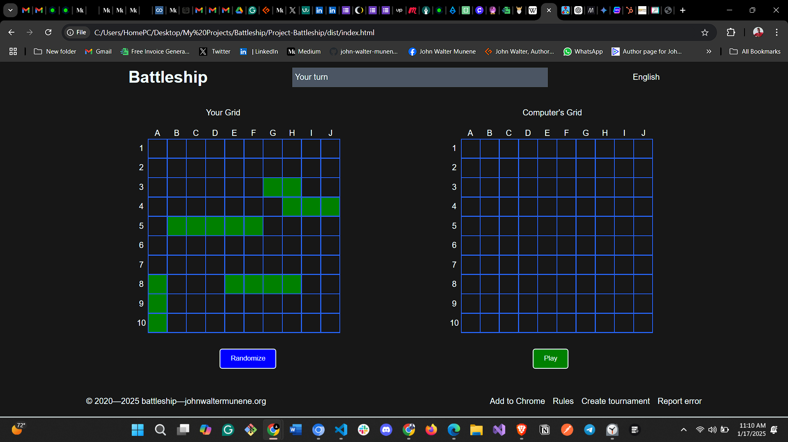

# Battleship Game

## Overview

This project is a JavaScript implementation of the classic Battleship game. The game allows a player to compete against a computer opponent, placing ships on a grid and attempting to sink the opponent's fleet before theirs is sunk.

## Features

- **Dynamic User Interface**: The game features a dynamic UI that updates in real-time as players make moves.
- **Object-Oriented Programming**: The game is structured using classes such as `GameBoard`, `Player`, and `Ship` to encapsulate functionality and data.
- **Asynchronous JavaScript**: The game uses asynchronous operations to handle computer moves, ensuring smooth gameplay.
- **Testing**: Comprehensive unit tests are provided to ensure the correctness of the game logic using Jest.
- **Modern Design**: Features a sleek, dark UI inspired by Cognition.ai with interactive hit announcements and ship tracking.

## Skills Demonstrated

- **DOM Manipulation**: The game dynamically updates the DOM to reflect the current state of the game board.
- **Object-Oriented Programming**: Utilizes classes and encapsulation to manage game state and logic.
- **ES6 Features**: Implements modern JavaScript features such as classes, arrow functions, and template literals.
- **Webpack**: The project is bundled using Webpack to manage dependencies and assets.
- **Testing with Jest**: The game logic is thoroughly tested using Jest, ensuring reliability and correctness.
- **Asynchronous Code**: Handles asynchronous operations for computer moves using `setTimeout`.

## How to Play

1. **Setup**: The game initializes with two players: a real player and a computer. Each player has a fleet of ships to place on their respective boards.
2. **Placing Ships**: Ships are placed randomly on the board at the start of the game. The real player can also randomize their ship placements.
3. **Gameplay**: Players take turns attacking each other's boards. The goal is to sink all of the opponent's ships.
4. **Winning the Game**: The first player to sink all of the opponent's ships wins the game.

## Installation

1. Clone the repository:
   ```bash
   git clone https://github.com/john-walter-munene/Project-Battleship
   ```

2. Navigate to the project directory:
   ```bash
   cd Project-Battleship-1
   ```

3. Install dependencies:
   ```bash
   npm install
   ```

4. Run development server:
   ```bash
   npm run dev
   ```

5. Build for production:
   ```bash
   npm run build
   ```

## Running Tests

```bash
npm test
```

## Project Structure

- `src/`: Contains the source code for the game.
  - `gameBoard.js`: Manages the game board state and logic.
  - `ship.js`: Defines the Ship class and its behavior.
  - `player.js`: Implements player behavior and actions.
  - `gameDisplay.js`: Handles UI updates and user interactions.
  - `resources/`: Contains CSS and font resources.
- `tests/`: Contains unit tests for the game logic.
- `dist/`: Contains the bundled output files.

## Deployment on Vercel

This project is configured for easy deployment on Vercel. Follow these steps:

### Prerequisites

1. Create a [Vercel account](https://vercel.com/signup) if you don't have one.
2. Install the Vercel CLI:
   ```bash
   npm install -g vercel
   ```

### Deployment Steps

1. Login to Vercel from the CLI:
   ```bash
   vercel login
   ```

2. Deploy the project (from project directory):
   ```bash
   vercel
   ```

3. For production deployment:
   ```bash
   vercel --prod
   ```

### Automatic Deployment with GitHub

1. Push your code to a GitHub repository.
2. Import the project in the Vercel dashboard.
3. Configure the build settings:
   - Build Command: `npm run build`
   - Output Directory: `dist`
4. Click "Deploy" and Vercel will automatically build and deploy your project.

### Configuration

The project includes a `vercel.json` file that configures how Vercel should build and serve the application. This ensures proper routing and static file serving.
